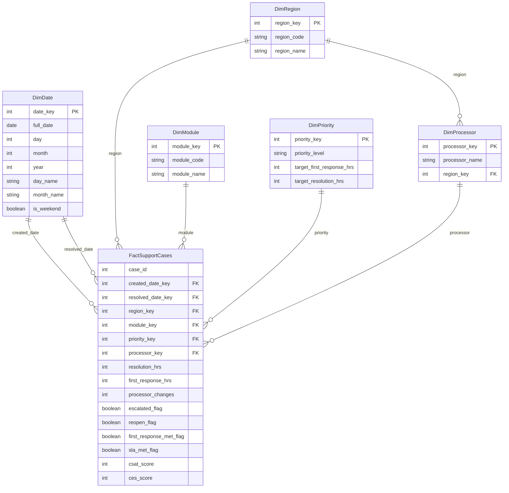

# Capstone: Analyzing the impact of losing Visa-Trainee Positions in Ontario
Explored healthcare analytics with real Ontario hospitals and stakeholders, building an analytical solution to assess the impact of gaining or losing visa trainees on patient care and system outcomes.

